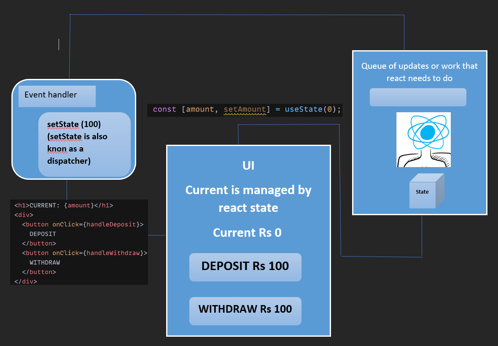
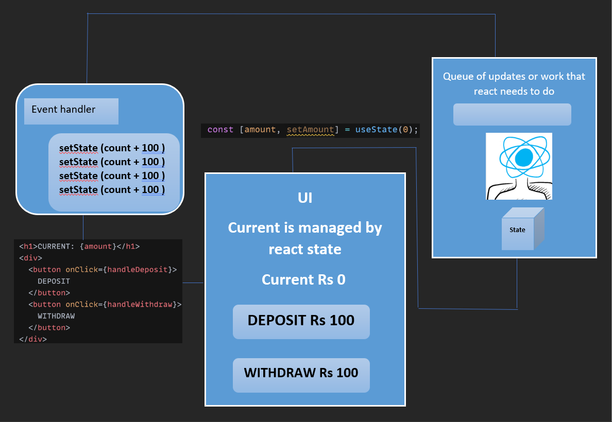

# REACT STATE DIAGRAMS

# Draw and explain the state diagrams for following on paper

# -> batch updates in setState

-> You have a Deposit 100 & withdraw 100 button, we click on Deposit 100 button the Eventhandle will happen and dispatcher function going towards queue. is trying to update the value.
-> The queue maintain the Status & all the element that needs to happen that will go the queue.
-> After see the data an the screen reart batches our updates and takes a not of it & it will update at last in one. go.
-> After that react performs contain operation that pract thinking about previous state & latest State & then react does === triple equality check.
-> The previous amount is 0 & latest amount is 100 if the 0 not equal to 100 then only react updatethe value.
React updates the UI and update new value on DOM.

# -> updater function in setState

-> The Event handle sets or sending for updater function it will go in the queue and sends one by one to check the 
data.
-> It will compare previous and Next 0+100, 0+100, 0+100 and 0+100 then the last Value check with === (triple equals to)
-> If the previous value and next value is not equal means the update value is not same as the before then react updates these value on UI.
-> Dom is
        -> UI
        -> managed by react
        -> Current Rs 100
        -> Deposit Rs 100
        -> Withdraw Rs 100